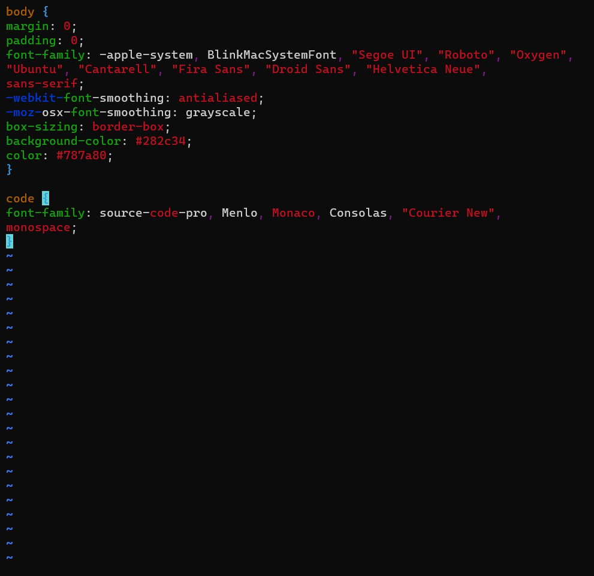

## PROJECT 3: MERN STACK IMPLEMENTATION
### DESIGNING A SIMPLE TO-DO APPLICATION ON MERN WEB STACK

**MERN** Web stack consists of following components:

**MongoDB:** A document-based, No-SQL database used to store application data in a form of documents.

**ExpressJS:** A server side Web Application framework for Node.js.

**ReactJS:** A frontend framework developed by Facebook. It is based on JavaScript, used to build User Interface (UI) components.

**Node.js:** A JavaScript runtime environment. It is used to run JavaScript on a machine rather than in a browser.

### STEP 1 – BACKEND CONFIGURATION

Firstly, connect to EC2 ubuntu instance and Update ubuntu: - `sudo apt update`  

Then upgrade ubuntu with the apt command: -  `sudo apt upgrade`     
Then get the location of Node.js software from Ubuntu repositories with the script: - `curl -fsSL https://deb.nodesource.com/setup_18.x | sudo -E bash -`       

### Installing Node.js on the server
`sudo apt-get install -y nodejs`   
The above script installs node.js and npm which is the package manager for Node    
To verify installation - I ran the script: `node -v`       

Result:
	      

To verify the node package installation, used script below  
`npm -v`        
Result:     
           

For Application Code Setup, I created a new directory for my To Do Project          

Use the `mkdir` command and then use `ls` to confirm creation.

Result:         
    

Change directory into Todo using the `cd` command.      

Next, I used the `npm init` to initialise your project, so that a new file named **package.json** will be created.      
In the process of installation, fillout the necessary details and accept the default parameters ans enter `yes` in the end to write out the package.json file.      

Result:
          

`ls` to confirm package creation        
Result:
       

### INSTALL EXPRESSJS

To use express, install it using npm:       
`npm install express`

Created a file index.js with the command below:     
`touch index.js`        

Run `ls`to confirm that your index.js file is successfully created:     
Result:     
             

Installed the dotenv module using the script:       
`npm install dotenv`        
Then opened the index.js with `vi index.js` file with the command below and pasted the script:      
           

This sets port to use |5000 

To start my server to see if it works, use the script `node index.js`       
Result:     
           

Then set my EC2 inbound rules for port 5000     
           

Opened up a browser to access my server’s Public IP     
http://<PublicIP-or-PublicDNS>:5000     

Result:         
             

**Routes**      
There are three actions that my To-Do application needs to be able to do:
1. Create a new task
2. Display list of all tasks
3. Delete a completed task

Each task will be associated with some particular endpoint and will use different standard HTTP request methods: POST, GET, DELETE.

For each task, we need to create `routes` that will define various endpoints that the `To-do` app will depend on.       

So let me create a folder *routes*

`mkdir routes`      
Then change to routes directory - `cd /routes`      

Now, create a file *api.js* with the command below: - `touch api.js`        
Open the file with the command below: - `vi api.js` and paste the text below:       

        

 ### CREATE MODELS

 Since the app is going to make use of Mongodb which is a NoSQL database, I needed to create a model.       
 A model is at the heart of JavaScript based applications, and it is what makes it interactive.     

 To create a Schema and a model, I installed mongoose which is a Node.js package that makes working with mongodb easier.        

 Still in the Todo directory, install mongoose with the script below:   
 `npm install mongoose`         

 Create a new folder models:        
`mkdir models`      
Change directory to *models* folder using cd and then inside the models folder, create a file and name it todo.js       
`touch todo.js`     
With the file opened with `vi todo.js` then pasted the code below in the file:      
           

In order to update our routes from the file api.js in ‘routes’ directory to make use of the new model.      

`vi api.js` and instert the text below as shown:        

          

 ### MONGODB DATABASE       

Signed up a free MongoDB database as a service solution.        
Created a database and generated a connection string.       

        

Then created a file in my Todo directory and named it .env and then inserted the connection string copied frm the above screeshot into .env. file =  *DB='mongodb+srv://ubuntu123:<password>@cluster0.3d1roud.mongodb.net/?retryWrites=true&w=majority'*            

Next is to update the index.js to reflect the use of .env so that Node.js can connect to the database.      

`vi index.js`       
Simply delete existing content in the file, and update it with the entire code below:       

     

Then start the server using the string below:   

`node index.js`

The result:     
            

### Testing Backend Code without Frontend using RESTful API

So far we have written backend part of our To-Do application, and configured a database, but we do not have a frontend UI yet. We need ReactJS code to achieve that. But during development, we will need a way to test our code using RESTfulL API. Therefore, we will need to make use of some API development client to test our code.

Using POSTMAN to test my API.       
First installed potman in my local machine.     
Created a post request to the API with my public IP: `http://<PublicIP-or-PublicDNS>:5000/api/todos`        

Note: make sure your set header key *Content-Type* as *application/json*

For the Post request:
           

For teh GET request:    
            

## STEP 2 – FRONTEND CREATION

Since we are done with the functionality we want from our backend and API, it is time to create a user interface for a Web client (browser) to interact with the application via API.

I used the `create-react-app` command       

In same /Todo directory - run the code:     
`npx create-react-app client`
*This created a new folder in my Todo directory called client, where I will add all the react code.*

### Running a React App

Install dependencies fisrt:

`npm install concurrently --save-dev`       
`npm install nodemon --save-dev`

In *Todo* folder vi into package.json file. Changed a part of the string with the code below:

`"scripts": {
"start": "node index.js",
"start-watch": "nodemon index.js",
"dev": "concurrently \"npm run start-watch\" \"cd client && npm start\""
},`

Configure Proxy in package.json
Switched to the *client* directory - cd /client     

Open the package.json file
`vi package.json`       

Add the key value pair in the package.json file `"proxy": "http://localhost:5000"`      

cd into the /Todo directory and started my db:
`npm run dev`           

### Creating React Components               

One of the advantages of react is that it makes use of components, which are reusable and also makes code modular. For our Todo app, there will be two stateful components and one stateless component.     

- cd client
- cd src - Inside your src folder I created *components*
- mkdir components
- cd components and then created three files as seen below
- touch Input.js ListTodo.js Todo.js
- vi Input.js and paste the below text      
          

Move to the src folder      
- cd ..
- cd .. to clients folder
- Installed Axios `npm install axios`
- Go to ‘components’ directory  `cd src/components`
- opened my ListTodo.js  `vi ListTodo.js` pasted text below and saved    
            

- write the below into Todo.js file:        
            

- To make little adjustment to our react code. Delete the logo and  adjust our App.js, Move to the src folder
- cd ..
- ran the command from src folder `vi App.js`       
- Copy and paste the code below into it     

          
       
- In the src directory open the App.css and paste the below text  
          

- In the src directory open the index.css
- paste the following code below:       
             
- Go to the Todo directory `cd ../..`
- `npm run dev`     
          

Then go to the browser and use mypublic ip on port 3000 to access my frontend as shown below:       

      

## Conclusion

In this Project-3, I have created a simple To-Do and deployed it to MERN stack. I wrote a frontend application using React.js that communicates with a backend application written using Expressjs. I also created a Mongodb backend for storing tasks in my database.

